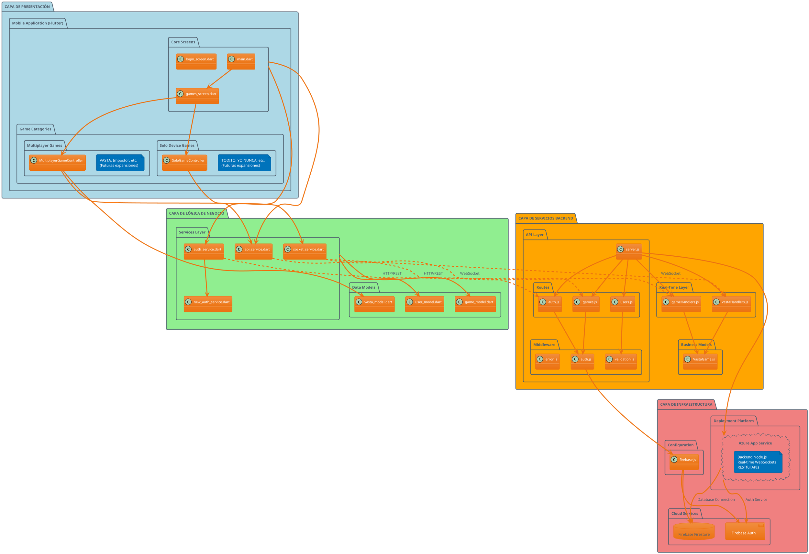

# Diagrama de Paquetes - Sistema LastShot

```plantuml
@startuml
!theme aws-orange
!define RECTANGLE class
allowmixing

package "CAPA DE PRESENTACIÓN" as presentation #lightblue {
  package "Mobile Application (Flutter)" as mobile_app {
    package "Core Screens" as core_screens {
      class "main.dart" as main
      class "games_screen.dart" as games_screen
      class "login_screen.dart" as login_screen
    }
    
    package "Game Categories" as game_categories {
      package "Multiplayer Games" as multiplayer_games {
        note "VASTA, Impostor, etc.\n(Futuras expansiones)" as multiplayer_note
        class "MultiplayerGameController" as multiplayer_controller
      }
      
      package "Solo Device Games" as solo_games {
        note "TODITO, YO NUNCA, etc.\n(Futuras expansiones)" as solo_note
        class "SoloGameController" as solo_controller
      }
    }
  }
}

package "CAPA DE LÓGICA DE NEGOCIO" as business #lightgreen {
  package "Services Layer" as services {
    class "socket_service.dart" as socket_service
    class "auth_service.dart" as auth_service
    class "api_service.dart" as api_service
    class "new_auth_service.dart" as new_auth_service
  }
  
  package "Data Models" as models {
    class "user_model.dart" as user_model
    class "game_model.dart" as game_model
    class "vasta_model.dart" as vasta_model
  }
}

package "CAPA DE SERVICIOS BACKEND" as backend #orange {
  package "API Layer" as api_layer {
    class "server.js" as server
    
    package "Routes" as routes {
      class "auth.js" as auth_routes
      class "games.js" as games_routes 
      class "users.js" as users_routes
    }
    
    package "Middleware" as middleware {
      class "auth.js" as auth_middleware
      class "validation.js" as validation_middleware
      class "error.js" as error_middleware
    }
  }
  
  package "Real-Time Layer" as realtime {
    class "gameHandlers.js" as game_handlers
    class "vastaHandlers.js" as vasta_handlers
  }
  
  package "Business Models" as business_models {
    class "VastaGame.js" as vasta_game_model
  }
}

package "CAPA DE INFRAESTRUCTURA" as infrastructure #lightcoral {
  package "Configuration" as config {
    class "firebase.js" as firebase_config
  }
  
  package "Cloud Services" as cloud_services {
    database "Firebase Firestore" as firestore
    component "Firebase Auth" as firebase_auth
  }
  
  package "Deployment Platform" as deployment {
    cloud "Azure App Service" as azure {
      note "Backend Node.js\nReal-time WebSockets\nRESTful APIs" as azure_note
    }
  }
}

' === RELACIONES DE DEPENDENCIA ===

' Frontend Dependencies
main --> games_screen
games_screen --> multiplayer_controller
games_screen --> solo_controller

' Game Controllers Dependencies
multiplayer_controller --> socket_service
solo_controller --> api_service

' Service Layer Dependencies  
core_screens --> auth_service
core_screens --> api_service
auth_service --> new_auth_service

' Model Dependencies
services --> user_model
services --> game_model
multiplayer_controller --> vasta_model

' Backend Dependencies
server --> auth_routes
server --> games_routes
server --> users_routes

auth_routes --> auth_middleware
games_routes --> auth_middleware
users_routes --> validation_middleware

server --> game_handlers
server --> vasta_handlers

game_handlers --> vasta_game_model
vasta_handlers --> vasta_game_model

' Infrastructure Dependencies
auth_middleware --> firebase_config
firebase_config --> firebase_auth
firebase_config --> firestore

' Deployment Dependencies
server --> azure
azure --> firestore : "Database Connection"
azure --> firebase_auth : "Auth Service"

' Cross-Layer Communications
socket_service ..> game_handlers : WebSocket
socket_service ..> vasta_handlers : WebSocket
auth_service ..> auth_routes : HTTP/REST
api_service ..> games_routes : HTTP/REST

@enduml
```