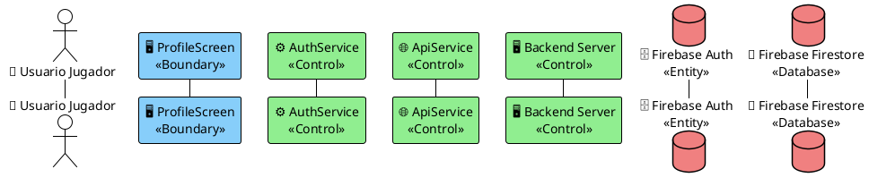

# UC01: Administrar Perfil de Usuario - Diagrama de Objetos

```plantuml
@startuml
!theme plain
' === ACTOR ===
actor "👤 Usuario Jugador" as Usuario

' === BOUNDARY ===
participant "🖥️ ProfileScreen\n<<Boundary>>" as Boundary #LightSkyBlue

' === CONTROL ===
participant "⚙️ AuthService\n<<Control>>" as Control1 #LightGreen
participant "🌐 ApiService\n<<Control>>" as Control2 #LightGreen
participant "🖥️ Backend Server\n<<Control>>" as Control3 #LightGreen

' === ENTITY / DATABASE ===
database "🗄️ Firebase Auth\n<<Entity>>" as Entity1 #LightCoral
database "💾 Firebase Firestore\n<<Database>>" as Entity2 #LightCoral

@enduml

```