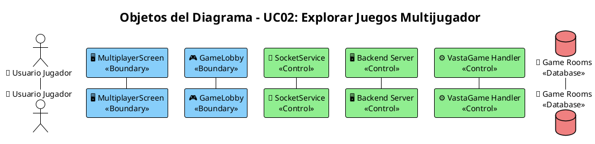

# UC02: Explorar Juegos Multijugador - Diagrama de Objetos

```plantuml
@startuml
!theme plain
title "Objetos del Diagrama - UC02: Explorar Juegos Multijugador"

' === ACTOR ===
actor "👤 Usuario Jugador" as Usuario

' === BOUNDARY ===
participant "🖥️ MultiplayerScreen\n<<Boundary>>" as Boundary1 #LightSkyBlue
participant "🎮 GameLobby\n<<Boundary>>" as Boundary2 #LightSkyBlue

' === CONTROL ===
participant "🔌 SocketService\n<<Control>>" as Control1 #LightGreen
participant "🖥️ Backend Server\n<<Control>>" as Control2 #LightGreen
participant "⚙️ VastaGame Handler\n<<Control>>" as Control3 #LightGreen

' === ENTITY / DATABASE ===
database "💾 Game Rooms\n<<Database>>" as Entity1 #LightCoral

@enduml

```