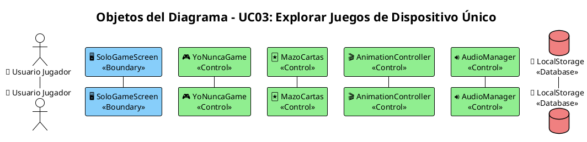

# UC03: Explorar Juegos de Dispositivo Único - Diagrama de Objetos

```plantuml
@startuml
!theme plain
title "Objetos del Diagrama - UC03: Explorar Juegos de Dispositivo Único"

' === ACTOR ===
actor "👤 Usuario Jugador" as Usuario

' === BOUNDARY ===
participant "🖥️ SoloGameScreen\n<<Boundary>>" as Boundary #LightSkyBlue

' === CONTROL ===
participant "🎮 YoNuncaGame\n<<Control>>" as Control1 #LightGreen
participant "🃏 MazoCartas\n<<Control>>" as Control2 #LightGreen
participant "🎬 AnimationController\n<<Control>>" as Control3 #LightGreen
participant "🔊 AudioManager\n<<Control>>" as Control4 #LightGreen

' === ENTITY / DATABASE ===
database "💾 LocalStorage\n<<Database>>" as Entity1 #LightCoral

@enduml

```