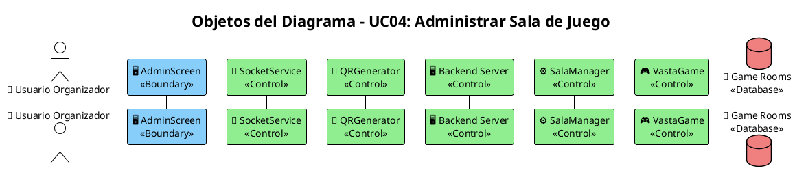

# UC04: Administrar Sala de Juego - Diagrama de Objetos

```plantuml
@startuml
!theme plain
title "Objetos del Diagrama - UC04: Administrar Sala de Juego"

' === ACTOR ===
actor "👑 Usuario Organizador" as Organizador

' === BOUNDARY ===
participant "🖥️ AdminScreen\n<<Boundary>>" as Boundary #LightSkyBlue

' === CONTROL ===
participant "🔌 SocketService\n<<Control>>" as Control1 #LightGreen
participant "📱 QRGenerator\n<<Control>>" as Control2 #LightGreen
participant "🖥️ Backend Server\n<<Control>>" as Control3 #LightGreen
participant "⚙️ SalaManager\n<<Control>>" as Control4 #LightGreen
participant "🎮 VastaGame\n<<Control>>" as Control5 #LightGreen

' === ENTITY / DATABASE ===
database "💾 Game Rooms\n<<Database>>" as Entity1 #LightCoral

@enduml

```